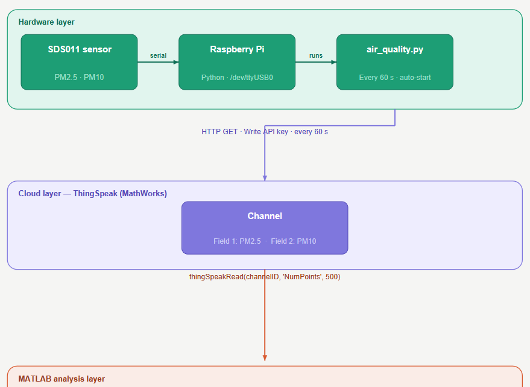

# MATLAB and ThingSpeak with Raspberry Pi

A starter guide to collect data from the SDS011 sensor with Raspberry Pi and store it in the ThingSpeak cloud platform, to visualize and analyze air quality data using MATLAB.

## Workflow Diagram


## Pre-requisites
To run this project on a Raspberry Pi device, ensure the following Python packages are installed:
- `sds011lib`
- `requests`

You can install these packages using the following command:
```bash
pip install sds011lib requests
```

## ThingSpeak Channel Setup
1.  **Sign up for ThingSpeak:** If you don't have an account, create one at [ThingSpeak.com](https://thingspeak.com/).
2.  **Create a New Channel:**
    *   Go to **Channels** > **My Channels** and click **New Channel**.
    *   Give your channel a name (e.g., "Air Quality Sensor").
    *   Add two fields:
        *   Field 1: `PM2.5`
        *   Field 2: `PM10`
    *   Save the channel.
3.  **Get Your Write API Key:**
    *   Go to the **API Keys** tab for your channel.
    *   Copy the **Write API Key**. You will need this for the `air_quality.py` script.

## Running the Script
### Running in the background
To run the Python script in the background, you can use the `nohup` command:
```bash
nohup python air_quality.py &
```
This will keep the script running even if you close the terminal. The output will be saved to a file named `nohup.out`.

### Running on boot
To have the script start automatically every time your Raspberry Pi boots up, you can use `crontab`:
1.  Open the crontab editor:
    ```bash
    crontab -e
    ```
2.  Add the following line to the end of the file, making sure to replace `/path/to/your/` with the actual path to the script:
    ```bash
    @reboot python /path/to/your/air_quality.py &
    ```
This will execute the Python script in the background on every startup.

## Acknowledgement
I would like to express my heartfelt gratitude to my colleagues for their invaluable support and collaboration throughout this project. Your insights and efforts have been instrumental in its success.
- @shahjehan67 and Zubair Ahmed
- @slemankfa and the team for sharing initial guides which really helped us implementing our workflow.

## Contribution
We welcome your contributions to this project! If you have any ideas, modifications, or advancements to suggest, we are eager to learn from you. Feel free to fork the repository, make changes, and submit a pull request. Your input is highly appreciated.

## Thank You
A special thank you to our professors (@MarcoRianiUNIPR and @Asadunipr) as their book's chapter on "Data Collection from Mobile Sensors" acted like a roadmap for implementing this.

## Contact
You can reach out to us if you need any help in the integration.