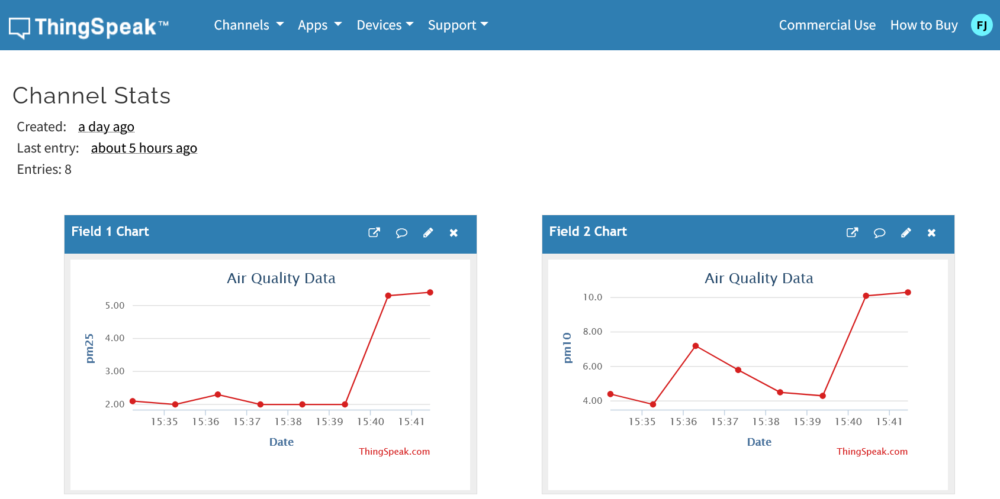

# MATLAB and ThingSpeak with Raspberry Pi

A starter guide to collect data from the SDS011 sensor with Raspberry Pi and store it in the ThingSpeak cloud platform, to visualize and analyze air quality data using MATLAB.

## Workflow Diagram


## Pre-requisites
To run this project on a Raspberry Pi device, ensure the following Python packages are installed:
- `sds011lib`
- `requests`

You can install these packages using the following command:
```bash
pip install sds011lib requests
```

## ThingSpeak Channel Setup
1.  **Sign up for ThingSpeak:** If you don't have an account, create one at [ThingSpeak.com](https://thingspeak.com/).
2.  **Create a New Channel:**
    *   Go to **Channels** > **My Channels** and click **New Channel**.
    *   Give your channel a name (e.g., "Air Quality Sensor").
    *   Add two fields:
        *   Field 1: `PM2.5`
        *   Field 2: `PM10`
    *   Save the channel.
3.  **Get Your Write API Key:**
    *   Go to the **API Keys** tab for your channel.
    *   Copy the **Write API Key**. You will need this for the `air_quality.py` script.

### ThingSpeak Channel Analytics


## Running the Script
### Run once (foreground)
```bash
python3 air_quality.py
```

### Run as a systemd service (recommended)
This is the most reliable way to run in the background and start on boot for Raspberry Pi OS.
1.  Create a service file (update `User` and paths):
    ```bash
    sudo tee /etc/systemd/system/air-quality.service > /dev/null << 'EOF'
    [Unit]
    Description=Air quality sensor to ThingSpeak
    After=network-online.target
    Wants=network-online.target

    [Service]
    Type=simple
    User=pi
    WorkingDirectory=/path/to/your
    ExecStart=/usr/bin/python3 /path/to/your/air_quality.py
    Restart=on-failure
    RestartSec=10

    [Install]
    WantedBy=multi-user.target
    EOF
    ```
2.  Enable and start the service:
    ```bash
    sudo systemctl daemon-reload
    sudo systemctl enable --now air-quality.service
    ```
3.  Check status and logs:
    ```bash
    sudo systemctl status air-quality.service
    sudo journalctl -u air-quality.service -f
    ```

## Important Notes
* ThingSpeak free version allows data update every 15 seconds
* Faster requests may be rejected
* Internet connection is required

## Acknowledgement
I would like to express my heartfelt gratitude to my colleagues for their invaluable support and collaboration throughout this project. Your insights and efforts have been instrumental in its success.
* [Shah Jehan](https://github.com/shahjehan67) and [Zubair Ahmed](https://github.com/zoobi1821) for their continuous efforts and dedication.
* [@slemankfa](https://github.com/slemankfa) and the team for sharing initial guides which really helped us implementing our workflow.

## Contribution
We welcome your contributions to this project! If you have any ideas, modifications, or advancements to suggest, we are eager to learn from you. Feel free to fork the repository, make changes, and submit a pull request. Your input is highly appreciated.

## Thank You
A special thank you to our professors [@MarcoRianiUNIPR](https://github.com/MarcoRianiUNIPR) and [@Asadunipr](https://github.com/Asadunipr) as their book's chapter on "Data Collection from Mobile Sensors" acted like a roadmap for implementing this.

## Contact
You can reach out to us if you need any help in the integration.
